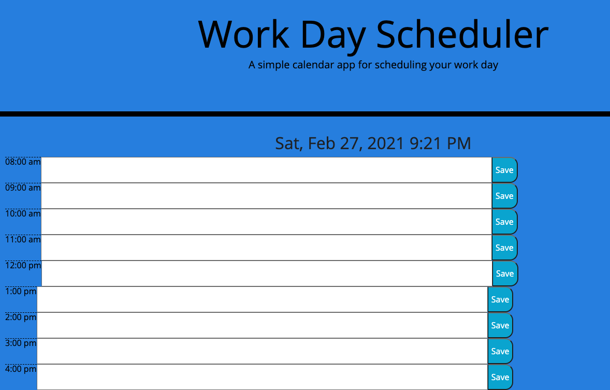

# office-day-scheduler

This is a office day scheduler
Can use this to help keep track of your meetings throughout the workday
The time will display automatically and constantly be up-to-date
You can type into each time section and save your meetings in each hourly category

https://yeatman51.github.io/office-day-scheduler/

https://github.com/Yeatman51/office-day-scheduler

